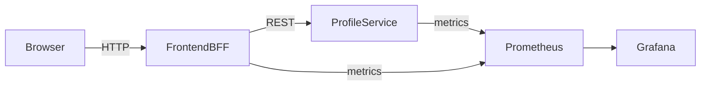

# @noctem/carlos-portfolio

> **Purpose**: A pragmatic, production‑minded portfolio demonstrating API engineering, Kubernetes operations, observability, and infrastructure-as-code — optimized for clarity, maintainability, and real-world tradeoffs rather than novelty.

---

## Table of Contents

- [High-Level Architecture](#high-level-architecture)
- [System Diagram (Simple & Readable)](#system-diagram-simple--readable)
- [Design Philosophy](#design-philosophy)
  - [Uncle Bob (Clean Architecture)](#uncle-bob-clean-architecture)
  - [Pragmatic Programmer](#pragmatic-programmer)
  - [How to Be an Awesome Architect](#how-to-be-an-awesome-architect)
  - [Linus Torvalds (Pragmatism & Simplicity)](#linus-torvalds-pragmatism--simplicity)
- [Observability & Operations](#observability--operations)
  - [Metrics Endpoints](#metrics-endpoints)
  - [Grafana Access (Local / Secure)](#grafana-access-local--secure)
  - [Kubernetes Port-Forward (Alternative)](#kubernetes-port-forward-alternative)
- [Repo Structure](#repo-structure)
- [CI/CD Summary](#cicd-summary)
- [Final Notes](#final-notes)
- [Roadmap & TODO (Post-Interview / Enterprise Hardening)](#roadmap--todo-post-interview--enterprise-hardening)

> This document is intentionally structured to be readable top-down or via direct section links.

---

## High-Level Architecture

This project intentionally favors **simplicity first, extensibility second**. Everything runs on a single-node Kubernetes cluster (k3s on Raspberry Pi) with a clear migration path to AWS EC2 and beyond.

### Core Components
- **frontend-bff (Spring Boot, WebFlux)**
  - API gateway / BFF pattern
  - Aggregates downstream services
  - Exposes `/api/*` and `/actuator/*`
- **profile-service (Go)**
  - Simple, fast, single-responsibility service
  - Exposes `/v1/*` domain endpoints + `/metrics`
- **Kubernetes (k3s)**
  - Single-node cluster (edge-friendly)
  - Declarative manifests committed to Git
- **Observability**
  - Prometheus (scraping via ServiceMonitors)
  - Grafana dashboards (JVM, Go, cluster)
- **CI/CD**
  - GitHub Actions
  - GHCR images
  - Self-hosted runner on the Pi
- **Future**
  - Terraform → AWS EC2
  - Optional Postgres

---

## System Diagram



---

## Design Philosophy

This project is guided by **practical engineering principles** rather than framework maximalism.

### Uncle Bob (Clean Architecture)
- Clear separation of concerns
- Services have **one reason to change**
- Infrastructure details are *outside* core logic

> "Good architecture allows major decisions to be deferred."

Applied here:
- Go service is framework-light
- Spring Boot BFF handles orchestration, not business rules

---

### Pragmatic Programmer
- Prefer **working software** over perfect abstractions
- Avoid speculative complexity
- Make tradeoffs explicit

> "You aren’t paid to write code, you’re paid to solve problems."

Applied here:
- Vanilla JS acceptable when Angular adds no immediate value
- Single-node k8s instead of premature EKS
- Focus on observability early

---

### How to Be an Awesome Architect
(Key ideas, not dogma)
- Optimize for **change**, not initial perfection
- Systems should be explainable on a whiteboard
- Make constraints visible

Applied here:
- One EC2 / one k3s node is a *deliberate constraint*
- Clear upgrade path to multi-node / cloud

---

### Linus Torvalds (Pragmatism & Simplicity)
- Simple solutions scale better
- Debuggability matters
- Avoid cleverness

Applied here:
- Go for services that must be boring and fast
- Explicit health + metrics endpoints
- Minimal magic in CI/CD

---

## Observability & Operations

### Metrics Endpoints
- **frontend-bff**: `/actuator/prometheus`
- **profile-service**: `/metrics`

### Prometheus
- Installed via `kube-prometheus-stack`
- Discovers services via `ServiceMonitor`

### Grafana Access (Local / Secure)

**SSH Tunnel:**
```bash
ssh -L 3000:127.0.0.1:3000 -L 9090:127.0.0.1:9090 actions@rpi-server.local
```

Then access locally:
- Grafana: http://localhost:3000
- Prometheus: http://localhost:9090

---

### Kubernetes Port-Forward

```bash
kubectl -n monitoring port-forward svc/monitoring-grafana 3000:80
kubectl -n monitoring port-forward svc/monitoring-kube-prometheus-prometheus 9090:9090
```

---

## Repo Structure

```bash
.github/workflows/     # CI/CD pipelines
k8s/
  base/                # Namespace, shared config
  frontend-bff/        # Deployment, Service, Ingress
  profile-service/     # Deployment, Service
  monitoring/          # Prometheus, ServiceMonitors
frontend-bff/          # Spring Boot BFF
profile-service/       # Go microservice
```

---

# ⚙️ Tech Stack

### **Backend**
- Golang
- Java / Spring Boot 3
- REST, gRPC, Protobuf
- Postgres (StatefulSet)

### **Frontend**
- React (Vite)
- TailwindCSS
- Served via Kubernetes ingress

### **Containers & Orchestration**
- Docker
- k3s (Kubernetes)
- Deployments, Services, Ingress, ConfigMaps, Secrets

### **API Gateway**
- Traefik or Kong OSS

### **Infrastructure-as-Code**
- Terraform (AWS EC2, IAM, VPC, S3)

### **Observability**
- Prometheus
- Grafana

### **CI/CD**
- GitHub Actions
- GHCR registry

---

# 📊 Observability

Prometheus scrapes:
- Go metrics
- Spring Boot Actuator
- Node exporter

Grafana shows:
- Latency
- Error rate
- Throughput

---

# 📜 License
MIT

