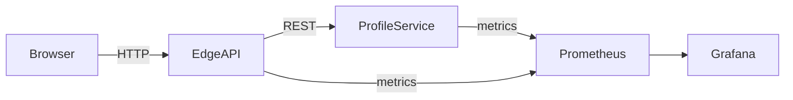

# Carlos Olson — Platform & Systems Reference Implementation

> **Purpose**  
> This repository is a **Staff-level platform and systems engineering reference implementation**.  
> It demonstrates **API contracts, service boundaries, delivery mechanics (CI/CD + GitOps), and operability**
> using a deliberately small, explainable system.
>
> This is **not a frontend portfolio**. The website and UI exist only to exercise backend, versioning,
> and platform concerns.

---

## Relationship to carlosolson.com

The public website (**carlosolson.com**) consumes the same APIs exposed here.
Some routes and paths exist on the website that are **presentation-layer only** and intentionally
*not duplicated* in the backend services.

This repository documents:
- **Authoritative API contracts**
- **Service-to-service communication**
- **Versioning, observability, and deployment mechanics**

---

## What Is Implemented vs Planned

### Implemented (Today)
- Spring Boot **BFF / Edge API**
- Go **profile-service**
- Explicit API contracts (`ROUTES.md`)
- **Service version endpoint** (build metadata, git SHA, build time)
- Kubernetes (k3s) manifests
- Prometheus + Grafana observability
- GitHub Actions CI
- Semantic-release versioning
- Container images published to GHCR
- Local development via Docker Compose

### Planned / Optional (Roadmap)
- Terraform (AWS EC2, IAM, VPC)
- Postgres StatefulSet
- gRPC / Protobuf service contracts
- API Gateway comparison (Traefik vs Kong)
- Multi-node Kubernetes

---

## High-Level Architecture

The system favors **clarity over scale**.  
Constraints are explicit and intentional.

### Core Components
- **UI (Angular / Web)**  
  Presentation-only; no business logic.
- **Edge API / BFF (Spring Boot, WebFlux)**  
  Orchestration, aggregation, and stability boundary.
- **profile-service (Go)**  
  Single-responsibility backend with explicit versioning.
- **Kubernetes (k3s)**  
  Declarative runtime environment.
- **Observability**  
  Prometheus scraping + Grafana dashboards.
- **Delivery**  
  GitHub Actions → versioned images → Kubernetes deploy.

---

## System Diagram



---

## Quickstart

### Local (Docker Compose)
```bash
docker compose up --build
```

- UI: http://localhost:3000  
- Edge API: http://localhost:8080  
- Version: http://localhost:8081/v1/version  
- Metrics: http://localhost:8080/actuator/prometheus  

### Kubernetes (k3s / minikube)
```bash
kubectl apply -k k8s/base
kubectl apply -k k8s/profile-service
kubectl apply -k k8s/frontend-bff
kubectl apply -k k8s/monitoring
```

---

## API Contract Surface

### Edge API (Spring Boot BFF)
- `GET /api/status`
- `GET /api/projects`
- `GET /api/experience`
- `GET /api/version`

### Backend (profile-service)
- `GET /v1/status`
- `GET /v1/projects`
- `GET /v1/experience`
- `GET /v1/version`

The **version endpoint** exposes:
- Service name
- Semantic version
- Git SHA
- Build timestamp
- Request timestamp

This enables:
- Runtime verification of deployments
- Debugging across environments
- Release traceability

---

## Key Design Decisions (Staff-Level)

- **Explicit Versioning**  
  Services expose build metadata to remove ambiguity in production.
- **BFF Pattern**  
  Prevents UI/back-end coupling and enables contract evolution.
- **Go for Core Service**  
  Fast startup, low memory, minimal abstraction.
- **Single-node Kubernetes**  
  Constraint is documented; migration path is clear.
- **Observability as Baseline**  
  Metrics are not optional.
- **Semantic Releases**  
  Deployments are traceable and auditable.

---

## Observability & Operations

### Metrics Endpoints
- Edge API: `/actuator/prometheus`
- profile-service: `/metrics`

### Grafana Access
```bash
kubectl -n monitoring port-forward svc/monitoring-grafana 3000:80
kubectl -n monitoring port-forward svc/monitoring-kube-prometheus-prometheus 9090:9090
```

---

## Security Posture

- No secrets committed to the repository
- Runtime configuration via Kubernetes Secrets / env vars
- Credentials rotated and audited (see CHANGELOG)
- Images built in CI and referenced by version

---

## CI/CD Summary

- GitHub Actions for build/test
- Semantic-release for versioning
- Images published to GHCR
- Kubernetes manifests consume versioned images

---

## Repository Structure

```bash
.github/workflows/     # CI pipelines
argocd/               # GitOps application definitions
k8s/                  # Kubernetes manifests
docker/               # Docker build assets
frontend-bff/         # Spring Boot Edge API
profile-service/      # Go backend service
web/                  # UI (presentation only)
docker-compose.yml    # Local development
ROUTES.md             # API contract surface
CHANGELOG.md          # Release history
```

---

## If You Only Have 5 Minutes

1. `profile-service/internal/http/version.go`
2. `frontend-bff` BFF controllers + client
3. `k8s/monitoring` ServiceMonitors
4. `.github/workflows` release pipeline
5. `CHANGELOG.md` for deployment history

---

## License
MIT
