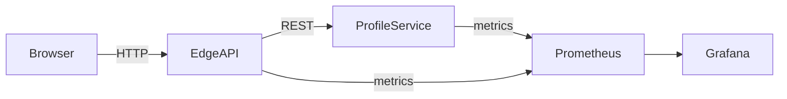

# Carlos Olson — Platform & Systems Reference Implementation

> **Purpose**  
> This repository is a **Staff-level platform engineering reference implementation**.  
> It demonstrates **service boundaries, delivery mechanics (CI/CD + GitOps), and operability**
> in a small, explainable system.  
>
> This is **not a frontend portfolio**. UI exists only to exercise backend and platform concerns.

---

## What Is Implemented vs Planned

### Implemented (Today)
- Spring Boot **BFF / Edge API**
- Go **profile-service**
- Clear API contracts (`ROUTES.md`)
- Kubernetes (k3s) manifests
- Prometheus + Grafana observability
- GitHub Actions CI
- Semantic-release versioning
- Container images published to GHCR
- Local development via Docker Compose

### Planned / Optional (Roadmap)
- Terraform (AWS EC2, IAM, VPC)
- Postgres StatefulSet
- gRPC / Protobuf service contracts
- API Gateway comparison (Traefik vs Kong)
- Multi-node Kubernetes

---

## High-Level Architecture

The system favors **clarity over scale**.  
It is intentionally small, with explicit boundaries and a clear migration path.

### Core Components
- **UI**  
  Minimal UI to drive API traffic.
- **Edge API (Spring Boot BFF)**  
  Aggregation, orchestration, and stability boundary.
- **profile-service (Go)**  
  Single-responsibility backend service.
- **Kubernetes (k3s)**  
  Declarative deployment and service discovery.
- **Observability**  
  Prometheus scraping + Grafana dashboards.
- **Delivery**  
  GitHub Actions → image build → versioned release.

---

## System Diagram



---

## Quickstart

### Local (Docker Compose)
```bash
docker compose up --build
```
- UI: http://localhost:3000  
- Edge API: http://localhost:8080  
- Metrics: http://localhost:8080/actuator/prometheus

### Kubernetes (k3s / minikube)
```bash
kubectl apply -k k8s/base
kubectl apply -k k8s/profile-service
kubectl apply -k k8s/frontend-bff
kubectl apply -k k8s/monitoring
```

API routes are documented in **ROUTES.md**.

---

## API Contract Surface

### UI Routes
- `/`
- `/projects`
- `/experience`

### Edge API (Spring Boot BFF)
- `GET /api/status`
- `GET /api/projects`
- `GET /api/experience`

### Backend (profile-service)
- `GET /v1/status`
- `GET /v1/projects`
- `GET /v1/experience`

The BFF exists to:
- Shield the UI from backend churn
- Aggregate responses
- Provide a stable contract

---

## Key Design Decisions (Staff-Level)

- **BFF Pattern**  
  Prevents UI/back-end coupling and simplifies evolution.
- **Go for profile-service**  
  Fast startup, low overhead, minimal abstraction.
- **Single-node Kubernetes**  
  Constraint is explicit; migration path is documented.
- **Metrics First**  
  Observability is not optional; it is baseline.
- **Semantic Versioning**  
  Releases are traceable and auditable.

---

## Observability & Operations

### Metrics Endpoints
- Edge API: `/actuator/prometheus`
- profile-service: `/metrics`

### Grafana Access (Port Forward)
```bash
kubectl -n monitoring port-forward svc/monitoring-grafana 3000:80
kubectl -n monitoring port-forward svc/monitoring-kube-prometheus-prometheus 9090:9090
```

- Grafana: http://localhost:3000  
- Prometheus: http://localhost:9090

---

## Security Posture

- No secrets committed to the repository
- Runtime configuration via Kubernetes Secrets / env vars
- Credentials rotated and audited (see CHANGELOG)
- Images built in CI and pulled by digest/tag

---

## CI/CD Summary

- GitHub Actions for build/test
- Semantic-release for versioning
- Images published to GHCR
- Kubernetes manifests consume versioned images

---

## Repository Structure

```bash
.github/workflows/     # CI pipelines
argocd/               # GitOps application definitions
k8s/                  # Kubernetes manifests
docker/               # Docker build assets
frontend-bff/         # Spring Boot Edge API
profile-service/      # Go backend service
web/                  # Minimal UI
docker-compose.yml    # Local development
ROUTES.md             # API contract surface
CHANGELOG.md          # Release history
```

---

## If You Only Have 5 Minutes

Look at:
1. `frontend-bff/` — edge API design and contracts
2. `profile-service/` — metrics and simplicity
3. `k8s/monitoring/` — ServiceMonitors and dashboards
4. `.github/workflows/` — build and release flow
5. `ROUTES.md` — explicit API surface

---

## License
MIT
